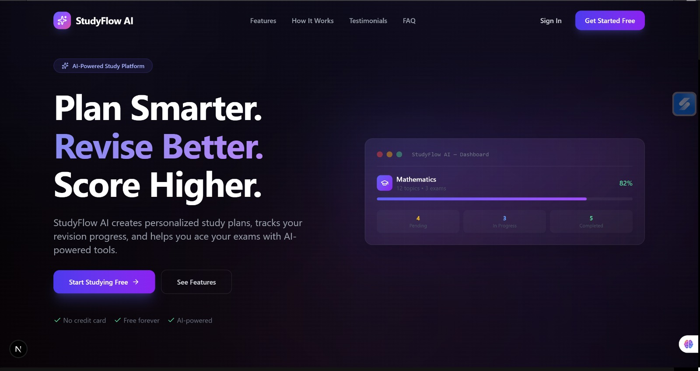
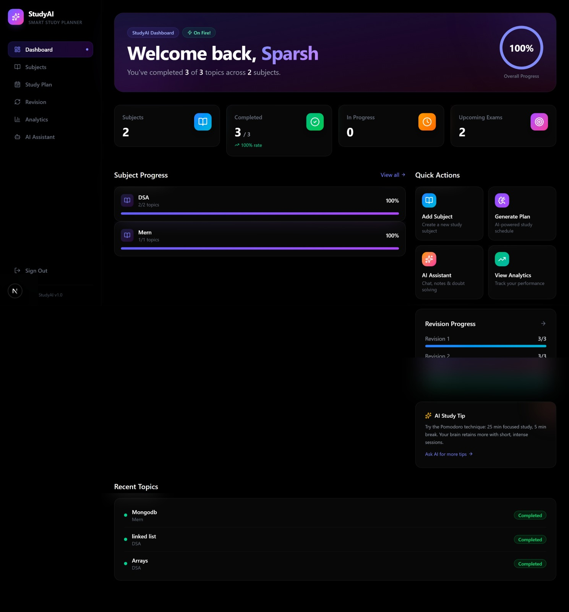
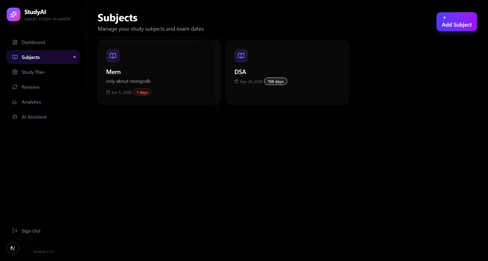
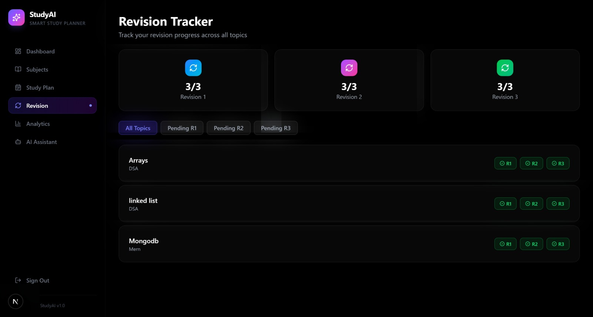
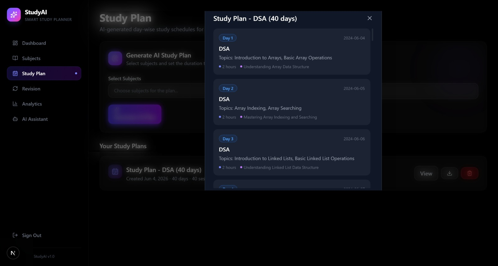
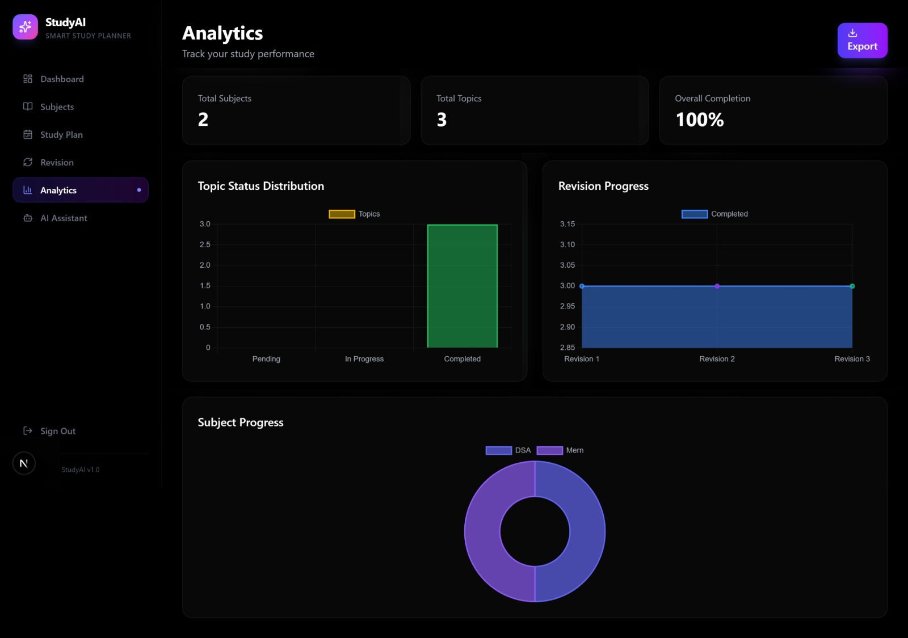
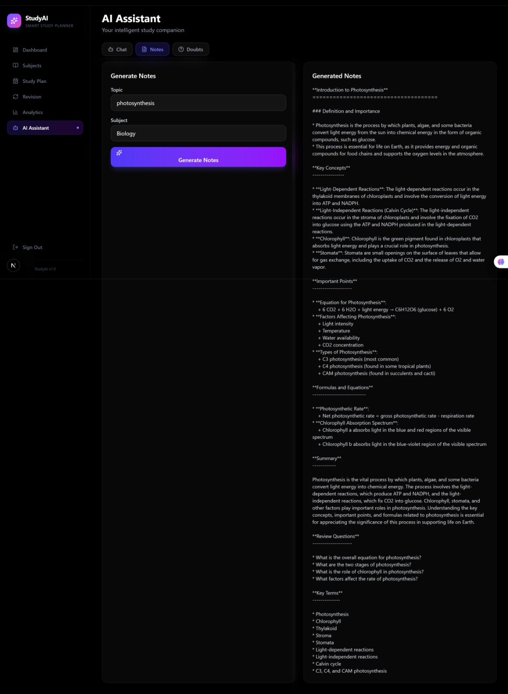

# 📚 StudyAI

StudyAI is an AI-powered study management platform designed to help students organize their learning, track revision progress, and improve productivity. The application provides subject management, revision tracking (R1, R2, R3), progress analytics, and note-taking features through a modern and responsive interface.

---

## ✨ Features

* 🔐 Secure Authentication with email confirmation
* 📖 Subject & Topic Management
* ✅ Revision Tracking (R1, R2, R3)
* 📊 Progress Analytics Dashboard
* 📝 Notes Management
* 📅 Study Planning & Tracking
* 📱 Responsive Design
* ☁️ Cloud Database with Supabase

---

## 🖼️ Screenshots

### Landing Page



### Dashboard



### Subject Management



### Revision Tracker



### Study Plan



### Analytics



### AI Features


---

## 🚀 Tech Stack

* Next.js
* React
* JavaScript
* Tailwind CSS
* Supabase
* PostgreSQL

---

## 🛠️ Installation

Clone the repository:

```bash
git clone https://github.com/your-username/studyai.git
cd studyai
```

Install dependencies:

```bash
npm install
```

Create a `.env.local` file and add:

```env
NEXT_PUBLIC_SUPABASE_URL=your_supabase_url
NEXT_PUBLIC_SUPABASE_ANON_KEY=your_supabase_anon_key
```

Run the development server:

```bash
npm run dev
```

Open:

```text
http://localhost:3000
```

---

## 📂 Project Structure

```text
StudyAI/
├── app/
├── components/
├── lib/
├── public/
├── screenshots/
├── Supabase/
└── README.md
```

---

## 🎯 Future Improvements

* AI-generated study recommendations
* Smart revision scheduling
* PDF report generation
* Study streak tracking
* Mobile application support
* AI-powered note summaries

---

## 👨‍💻 Author

Developed by Sparsh Chauhan as a student productivity and revision management platform.

If you found this project useful, consider giving it a ⭐ on GitHub.
